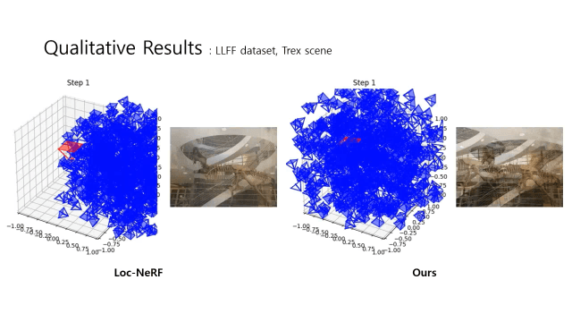
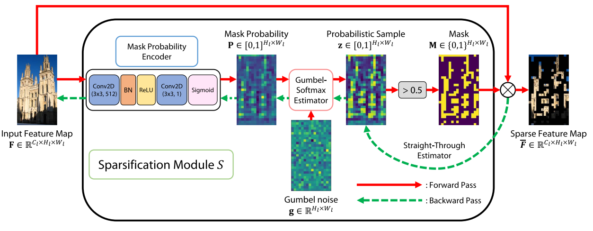
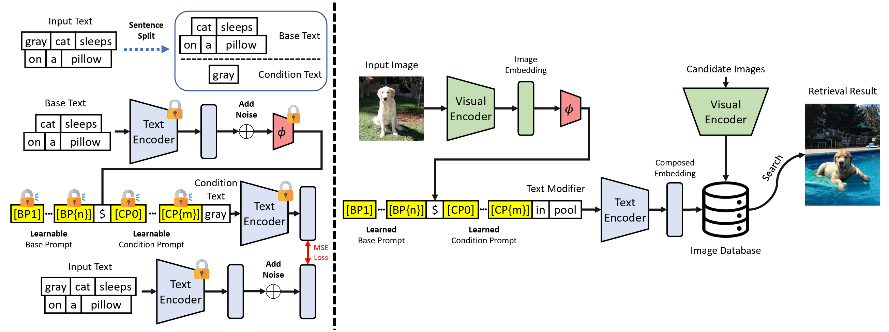
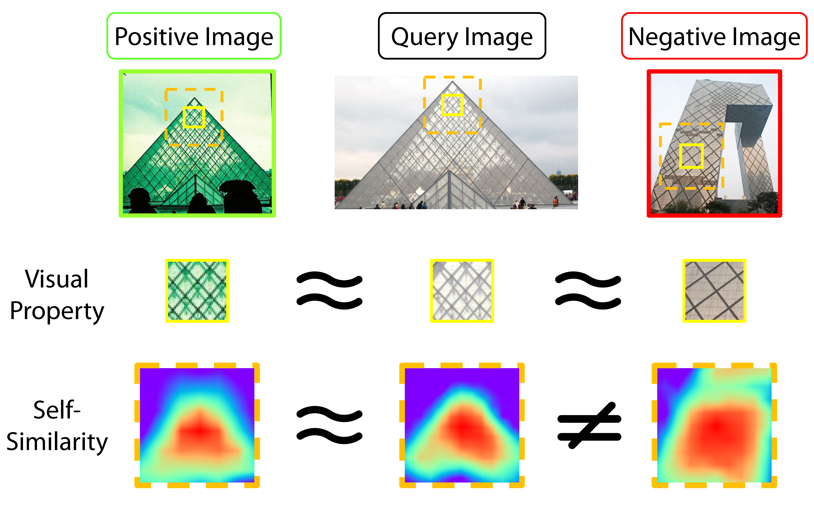
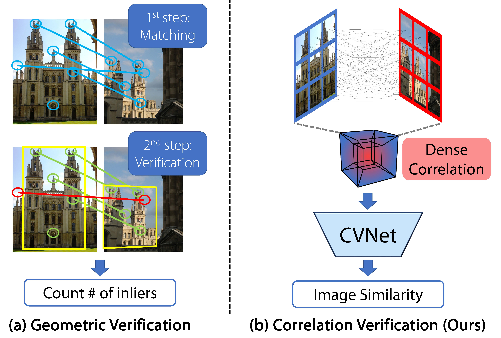
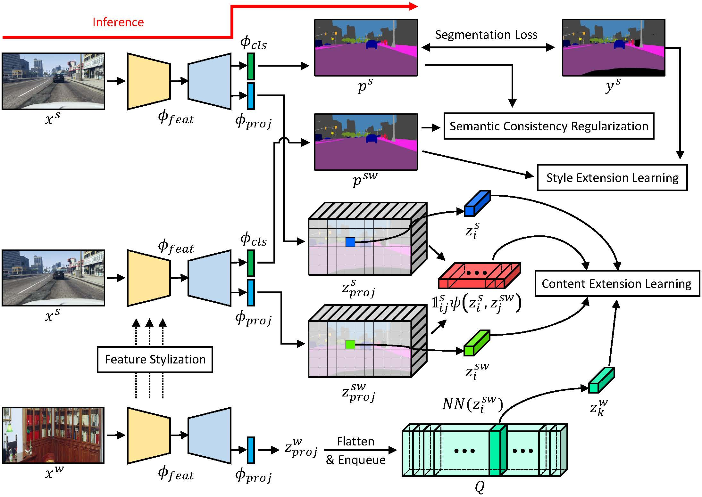
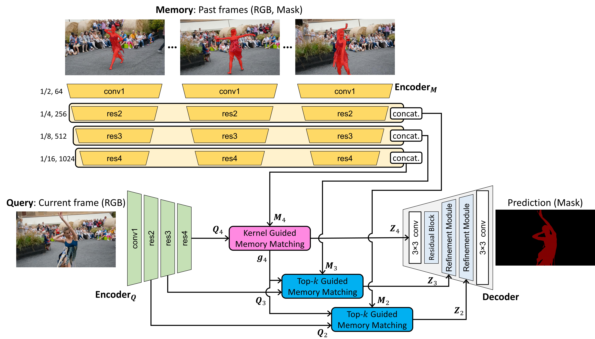








I'm **Seongwon Lee**, a _assistant professor_ at the [School of Electrical Engineering](https://ee.kookmin.ac.kr) at [Kookmin University](https://english.kookmin.ac.kr). I am currently the _principal investigator_ of the [Computational Intelligence Lab (CILAB)](https://cilab.kookmin.ac.kr). Previously, I was a researcher in the [Visual Intelligence Laboratory](https://etri-visualintelligence.github.io/) at [ETRI](https://www.etri.re.kr/eng/main/main.etri). Before that, I received my Ph.D. and B.S. degrees in [Electrical and Electronic Engineering](https://ee.yonsei.ac.kr/ee_en/index.do) from [Yonsei University](https://www.yonsei.ac.kr/en_sc/) in 2023 and 2016, respectively, advised by Professor [Euntai Kim](https://cilab.yonsei.ac.kr/). 

I am interested in building algorithms and machines that can understand the world and communicate with humans. My research focuses on learning deep networks that can solve a wide range of problems using a few general interfaces.

# 🎉 News
- *(Sep 2025)* 🧑🏻‍🏫 Giving an invited talk about Neural Rendering: Creating Reality with AI @ Yonsei University.
- *(Jul 2025)* 🧑🏻‍🏫 Giving an invited talk about Neural Rendering Using Vision and LiDAR and Its Application in Map Representation @ SOSLAB.
- *(Jul 2025)* 🧑🏻‍🏫 Giving an invited talk about Recent Advances in Spatial AI: The Present and Future of Spatial Intelligence @ Gachon University.
- *(Jun 2025)* 💼 I have started a project related to 3D Reconstruction in collaboration with KETI.
- *(Apr 2025)* 💼 I have started a project related to Image Generation in collaboration with ETRI.
- *(Apr 2025)* 🧑🏻‍🏫 Giving an invited talk about Neural Rendering: NeRF and 3D Gaussian Splatting @ KETI.
- *(Mar 2025)* 🧑🏻‍🏫 Giving an invited talk about Match and Extend: Visual-Based Matching and 3D Reconstruction Technology @ ETRI.
- *(Feb 2025)* 📃 One paper has been accepted to ICRA 2025.
- *(Nov 2024)* 📃 One paper has been accepted to IEEE Transactions on Pattern Analysis and Machine Intelligence (TPAMI) (IF: 20.6, JCR Top 1%).
- *(Oct 2024)* 📃 One paper has been accepted to IEEE Transactions on Pattern Analysis and Machine Intelligence (TIV) (IF: 14.0, JCR Top 2%).
- *(Oct 2024)* 📃 One paper has been accepted to IEEE Access (IF: 3.4, JCR Top 40%).
- *(Aug 2024)* 🏫 I am starting my assistant professorship in Kookmin University.
- *(Jul 2024)* 📃 One paper has been accepted to ECCVW 2024.
- *(Jan 2024)* 🧑🏻‍🏫 Giving an invited talk about recent computer vision research trends @ Yonsei University. [[slide]](https://drive.google.com/file/d/1AS2djykCUuBL5o9tbf6CG_T8U4xLkZlB/view?usp=drive_link)
- *(Oct 2023)* 🧑🏻‍🏫 Giving an invited talk about image retrieval @ Jeonbuk National University. [[slide]](https://drive.google.com/file/d/1fW5CCr2GB1FcbikLkqMRpAipIjUtzOMP/view?usp=drive_link) 
- *(Aug 2023)* 📃 One paper has been accepted to BMVC 2023.
- *(Feb 2023)* 📃 One paper has been accepted to CVPR 2023.
- *(Nov 2022)* 🎉 I won the [Qualcomm Innovation Fellowship 2022](https://www.qualcomm.com/research/university-relations/innovation-fellowship/winners).
- *(Oct 2022)* 🎉 I won the Excellence Vision Research Award at the 1ˢᵗ Yonsei AI Workshop.
- *(Mar 2022)* 🎉 A paper titled “Correlation Verification for Image Retrieval” has been selected for **Oral presentation** in CVPR 2022.
- *(Mar 2022)* 📃 Two papers have been accepted to CVPR 2022. 
- *(Jul 2021)* 📃 One paper has been accepted to ICCV 2021. 

<!-- Lightbox CSS -->
<link href="https://cdn.jsdelivr.net/npm/lightbox2@2/dist/css/lightbox.min.css" rel="stylesheet">

# 📚 Selected Publications 
[Google Scholar full list](https://scholar.google.com/citations?hl=en&user=wKlb8_gAAAAJ), † denotes corresponding author

  
  

    <strong>VG3T: Visual Geometry Grounded Gaussian Transformer</strong> 
    Junho Kim, <strong>Seongwon Lee†</strong> 
    IEEE International Conference on Robotics and Automation (**ICRA**), 2026, Under reviewed
  

  
  

    <strong>Fast Global Localization on Neural Radiance Field</strong> 
    Mangyu Kong, Jaewon Lee, <strong>Seongwon Lee†</strong>, Euntai Kim† 
    IEEE International Conference on Robotics and Automation (**ICRA**), May 2025 
    [[arXiv]](https://arxiv.org/abs/2406.12202)&nbsp;&nbsp;
  

  
  

    <strong>Correlation Verification for Image Retrieval and Its Memory Footprint Optimization</strong> 
    <strong>Seongwon Lee</strong>, Hongje Seong, Suhyeon Lee, Euntai Kim† 
    Accepted, Transactions on Pattern Analysis and Machine Intelligence (**TPAMI**), Nov 2024 
    [[paper]](https://ieeexplore.ieee.org/document/10759842)
  

  
  

    <strong>Location-Aware Transformer Network for Bird’s Eye View Semantic Segmentation</strong> 
    Suhan Woo, Minseong Park, Youngjo Lee, <strong>Seongwon Lee</strong>, Euntai Kim† 
    Accepted, Transactions on Intelligent Vehicles (**TIV**), Oct 2024 
    [[paper]](https://ieeexplore.ieee.org/document/10729649)
  

  
  

    <strong>Language-only Efficient Prompt Learning for Zero-shot Composed Image Retrieval</strong> 
    <strong>Seongwon Lee</strong>, Yong-Ju Lee† 
    European Conference on Computer Vision Workshop (**ECCVW (Green-FOMO Workshop)**), Oct 2024
  

  
  

    <strong>RoomNeRF: Representing Empty Room as Neural Radiance Fields for View Synthesis</strong> 
    Mangyu Kong, <strong>Seongwon Lee</strong>, Euntai Kim† 
    The British Machine Vision Conference (**BMVC**), Nov 2023 
    [[page]](https://proceedings.bmvc2023.org/825/) [[paper]](https://papers.bmvc2023.org/0825.pdf) [[supp]](https://bmvc2022.mpi-inf.mpg.de/BMVC2023/0825_supp.zip) [[poster]](https://bmvc2022.mpi-inf.mpg.de/BMVC2023/0825_poster.pdf) [[video]](https://bmvc2022.mpi-inf.mpg.de/BMVC2023/0825_video.mp4)
  

  
  

    <strong>Revisiting Self-Similarity: Structural Embedding for Image Retrieval</strong> 
    <strong>Seongwon Lee</strong>, Suhyeon Lee, Hongje Seong, Euntai Kim† 
    IEEE/CVF Conference on Computer Vision and Pattern Recognition (**CVPR**), Jun 2023 
    [[page]](https://openaccess.thecvf.com/content/CVPR2023/html/Lee_Revisiting_Self-Similarity_Structural_Embedding_for_Image_Retrieval_CVPR_2023_paper.html) [[paper]](https://openaccess.thecvf.com/content/CVPR2023/papers/Lee_Revisiting_Self-Similarity_Structural_Embedding_for_Image_Retrieval_CVPR_2023_paper.pdf)
  

  
  

    <strong>Correlation Verification for Image Retrieval</strong> 
    <strong>Seongwon Lee</strong>, Hongje Seong, Suhyeon Lee, Euntai Kim† 
    IEEE/CVF Conference on Computer Vision and Pattern Recognition (**CVPR**), Jun 2022 
    Selected as an Oral Presentation 
    [[paper]](https://openaccess.thecvf.com/content/CVPR2022/papers/Lee_Correlation_Verification_for_Image_Retrieval_CVPR_2022_paper.pdf)
  

  
  

    <strong>WildNet: Learning Domain Generalized Semantic Segmentation from the Wild</strong> 
    Suhyeon Lee, Hongje Seong, <strong>Seongwon Lee</strong>, Euntai Kim† 
    IEEE/CVF Conference on Computer Vision and Pattern Recognition (**CVPR**), Jun 2022
  

  
  

    <strong>Hierarchical Memory Matching Network for Video Object Segmentation</strong> 
    Hongje Seong, Seoung Wug Oh, Joon-Young Lee, <strong>Seongwon Lee</strong>, Suhyeon Lee, Euntai Kim† 
    IEEE/CVF International Conference on Computer Vision (**ICCV**), Oct 2021
  

<!-- Lightbox JS -->

# 🎖 Honors and Awards
- *(Jul 2023)* 2023-1 Graduate School of Yonsei University Thesis Award (2023)
  - Encouragement Award - *Correlation Verification for Image Retrieval* (CVPR 2022)
- *(Nov 2022)* [Qualcomm Innovation Fellowship 2022](https://www.qualcomm.com/research/university-relations/innovation-fellowship/winners)
  - Winner ($4,000) - *Correlation Verification for Image Retrieval* (CVPR 2022)
- *(Oct 2022)* 1st Yonsei AI Workshop (2022)
  - Excellence Vision Research Award - *Correlation Verification for Image Retrieval* (CVPR 2022)

# 💼 Projects
- *(Apr 2025 - Nov 2025)* Development of High-Fidelity Vehicle Representation via 3D Gaussian Splatting
  - Funding from Korea Electronics Technology Institute (KETI)
- *(Jun 2025 - Nov 2025)* Development of Brain Signal Based Image Generation
  - Funding from Electronics and Telecommunications Research Institute (ETRI)
- *(Aug 2023 - Aug 2024)* Development of AI Autonomy and Knowledge Enhancement for AI Agent Collaboration
  - Funding from Information & Communications Technology Promotion (IITP)
- *(Apr 2022 - Dec 2022)* Development of Deep Learning-Based Fine-Matching Technology using ToF Depth Sensor
  - Funding from LG Electronics
- *(May 2021- Dec 2021)* Development of Deep Learning-Based Image Retrieval Technology using ToF Depth Sensor
  - Funding from LG Electronics
- *(Apr 2020 - Feb 2021)* Development of Front-Down SLAM Technology Based on ToF Depth Sensor
  - Funding from LG Electronics
- *(Apr 2019 - Dec 2019)* Development of Depth Map Generation Technology using Continuous Stereo Images
  - Funding from Hyundai AutoEver
- *(Oct 2017 - Feb 2019)* Development of Integration Module Technology for Localization and Autonomous Driving Control Based on Multi-modal Sensor for Wheel Drive Service Robot
  - Funding from Ministry of Trade, Industry and Energy (MOTIE)
- *(Oct 2016 - Oct 2017)* Development of Robot Autonomous Driving Technology using Laser Scanner
  - Funding from  Hitachi-LG Data Storage
- *(May 2016 - Apr 2020)* Development of Robot Intelligence Technology for Mobility with Learning Capability
toward Robust and Seamless Indoor and Outdoor Autonomous Navigation
  - Funding from Ministry of Trade, Industry and Energy (MOTIE)

# 💻 Academic Services
- Invited Talks
   - *(Sep 2025)* Neural Rendering: Creating Reality with AI 
      - School of Electrical and Electronic Engineering, Yonsei University
   - *(Jul 2025)* Neural Rendering Using Vision and LiDAR and Its Application in Map Representation
      - SOSLAB
   - *(Jul 2025)* Recent Advances in Computer Vision: Foundation Models, Vision-Language Models and 3D Neural Representations
      - School of Computing, Gachon University
   - *(Apr 2025)* Neural Rendering: NeRF and 3D Gaussian Splatting
      - Korea Electronics Technology Institute (KETI)
   - *(Mar 2025)* Match and Extend: Visual-Based Matching and 3D Reconstruction Technology
      - Electronics and Telecommunications Research Institute (ETRI)
   - *(Jan 2024)* Recent Advances in Computer Vision: Foundation Models, Vision-Language Models and 3D Neural Representations [[slide]](https://drive.google.com/file/d/1AS2djykCUuBL5o9tbf6CG_T8U4xLkZlB/view?usp=drive_link)
      - School of Electrical and Electronic Engineering, Yonsei University
   - *(Oct 2023)* Introduction to Image Retrieval: Local Features & beyond [[slide]](https://drive.google.com/file/d/1fW5CCr2GB1FcbikLkqMRpAipIjUtzOMP/view?usp=drive_link)
      - Department of Electronic Engineering, Jeonbuk National University
- Reviewer
   - Conference
      - IEEE/CVF Computer Vision and Pattern Recognition Conference (CVPR)
      - European Conference on Computer Vision (ECCV)
      - IEEE/CVF International Conference on Computer Vision (ICCV)
      - IEEE International Conference on Robotics and Automation (ICRA)
      - IEEE International Conference on Robotics and Automation (IROS)
      - Asian Conference on Computer Vision (ACCV)
   - Journal
      - IEEE Transactions on Pattern Analysis and Machine Intelligence (TPAMI)
      - IEEE Transactions on Automation Science and Engineering (T-ASE)
      - International Journal of Control, Automation and Systems (IJCAS)
