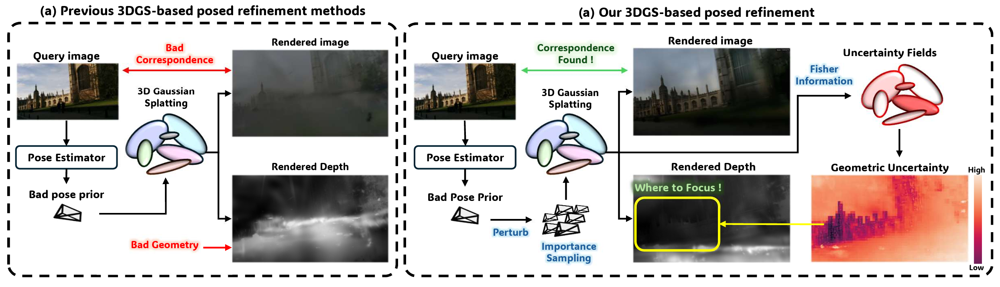
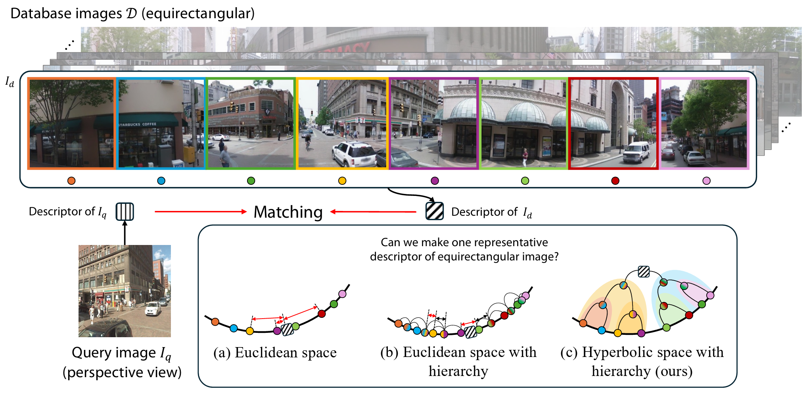
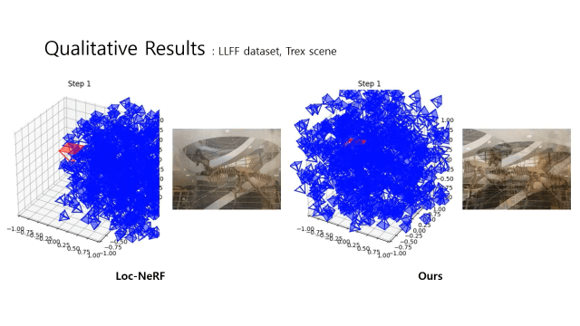
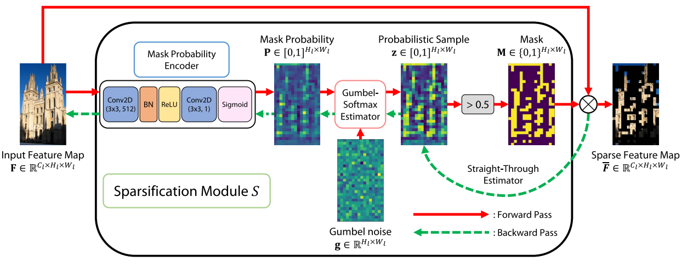
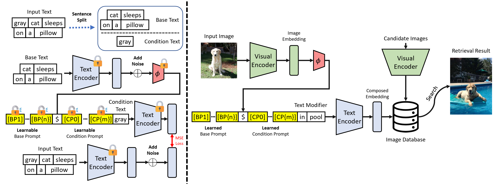
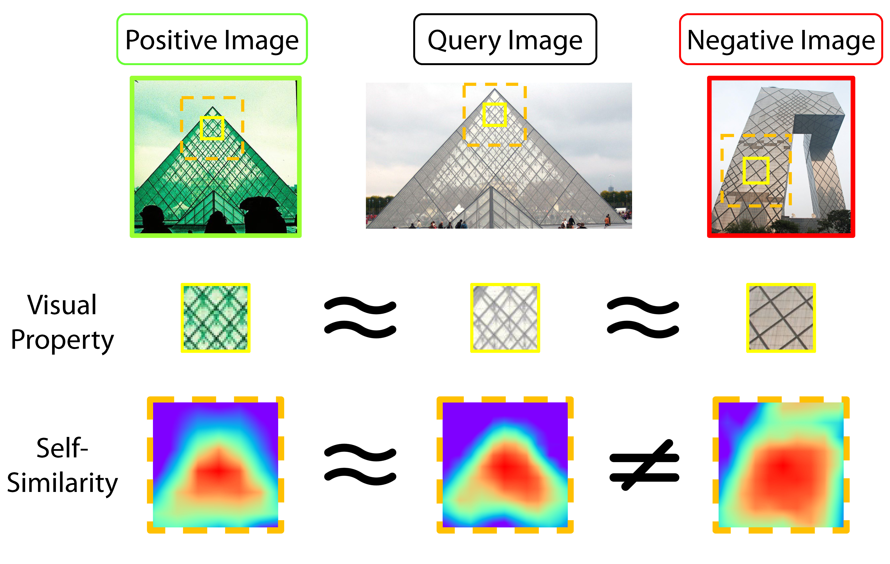
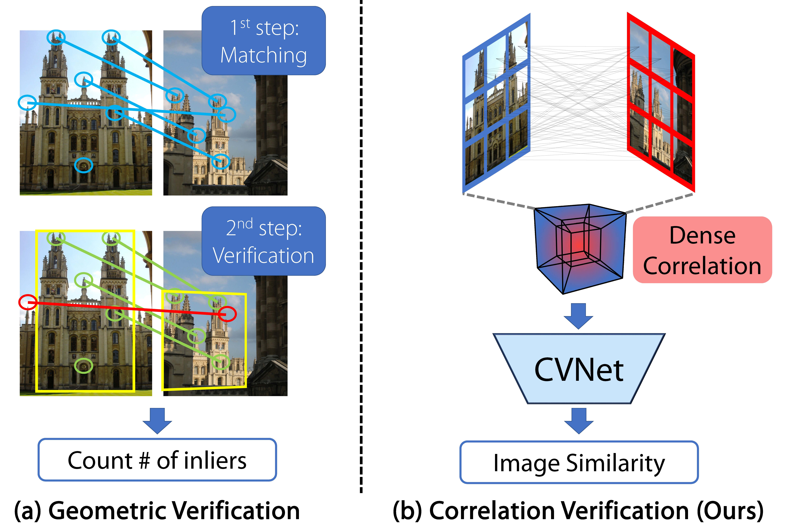
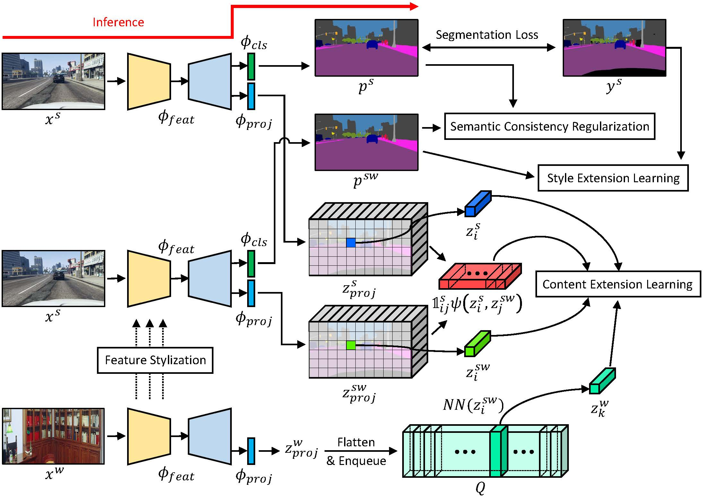
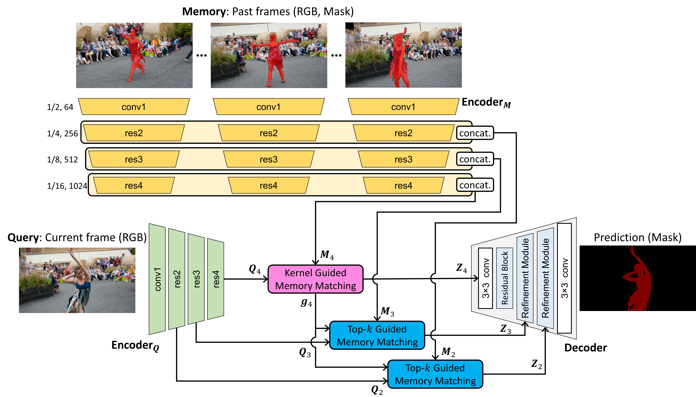








I'm **Seongwon Lee**, a _assistant professor_ at the [School of Electrical Engineering](https://ee.kookmin.ac.kr) at [Kookmin University](https://english.kookmin.ac.kr). I am currently the _principal investigator_ of the [Computational Intelligence Lab (CILAB)](https://cilab.kookmin.ac.kr). Previously, I was a researcher in the [Visual Intelligence Laboratory](https://etri-visualintelligence.github.io/) at [ETRI](https://www.etri.re.kr/eng/main/main.etri). Before that, I received my Ph.D. and B.S. degrees in [Electrical and Electronic Engineering](https://ee.yonsei.ac.kr/ee_en/index.do) from [Yonsei University](https://www.yonsei.ac.kr/en_sc/) in 2023 and 2016, respectively, advised by Professor [Euntai Kim](https://cilab.yonsei.ac.kr/).

I am interested in building algorithms and machines that can understand the world and communicate with humans. My research focuses on learning deep networks that can solve a wide range of problems using a few general interfaces.

# 🎉 News
- *(Mar 2026)* 💼 I have started a project on vision-based cargo and cargo label recognition on robots in logistics warehouse environments in collaboration with BStar Robotics.
- *(Mar 2026)* 💼 I has been selected for the Outstanding Young Scientist Grant from the National Research Foundation of Korea (NRF) for the project, Vision-Language Navigation Agents via Cyclic Expansion of Web-Scale Video, Augmented Simulation, and the Real World.
- *(Feb 2026)* 📝 Two papers have been accepted to CVPR 2026.
- *(Jan 2026)* 📝 One paper has been accepted to ICRA 2026.
- *(Sep 2025)* 🎤 Giving an invited talk about Neural Rendering: Creating Reality with AI @ Yonsei University.
- *(Sep 2025)* 📝 One paper has been published in IEEE Transactions on Intelligent Vehicles (TIV) (IF: 14.0, JCR Top 2%).
- *(Jul 2025)* 🎤 Giving an invited talk about Neural Rendering Using Vision and LiDAR and Its Application in Map Representation @ SOSLAB.
- *(Jul 2025)* 🎤 Giving an invited talk about Recent Advances in Spatial AI: The Present and Future of Spatial Intelligence @ Gachon University.
- *(Jun 2025)* 💼 I have started a project related to 3D Reconstruction in collaboration with KETI.
- *(Apr 2025)* 💼 I have started a project related to Image Generation in collaboration with ETRI.
- *(Apr 2025)* 🎤 Giving an invited talk about Neural Rendering: NeRF and 3D Gaussian Splatting @ KETI.
- *(Mar 2025)* 🎤 Giving an invited talk about Match and Extend: Visual-Based Matching and 3D Reconstruction Technology @ ETRI.
- *(Feb 2025)* 📝 One paper has been accepted to ICRA 2025.
- *(Nov 2024)* 📝 One paper has been published in IEEE Transactions on Pattern Analysis and Machine Intelligence (TPAMI) (IF: 20.6, JCR Top 1%).
- *(Oct 2024)* 📝 One paper has been accepted to IEEE Access (IF: 3.4, JCR Top 40%).
- *(Aug 2024)* 👨‍🏫 I am starting my assistant professorship in Kookmin University.
- *(Jul 2024)* 📝 One paper has been accepted to ECCVW 2024.
- *(Jan 2024)* 🎤 Giving an invited talk about recent computer vision research trends @ Yonsei University. [[slide]](https://drive.google.com/file/d/1AS2djykCUuBL5o9tbf6CG_T8U4xLkZlB/view?usp=drive_link)
- *(Oct 2023)* 🎤 Giving an invited talk about image retrieval @ Jeonbuk National University. [[slide]](https://drive.google.com/file/d/1fW5CCr2GB1FcbikLkqMRpAipIjUtzOMP/view?usp=drive_link)
- *(Aug 2023)* 📝 One paper has been accepted to BMVC 2023.
- *(Feb 2023)* 📝 One paper has been accepted to CVPR 2023.
- *(Nov 2022)* 🏆 I won the [Qualcomm Innovation Fellowship 2022](https://www.qualcomm.com/research/university-relations/innovation-fellowship/winners).
- *(Oct 2022)* 🏆 I won the Excellence Vision Research Award at the 1st Yonsei AI Workshop.
- *(Mar 2022)* 🏆 A paper titled "Correlation Verification for Image Retrieval" was selected for **Oral presentation** in CVPR 2022.
- *(Mar 2022)* 📝 Two papers have been accepted to CVPR 2022.
- *(Jul 2021)* 📝 One paper has been accepted to ICCV 2021.

# 📚 Selected Publications
[Google Scholar full list](https://scholar.google.com/citations?hl=en&user=wKlb8_gAAAAJ), `*` denotes corresponding author

  <button type="button" class="publication-image-modal__close" aria-label="Close image">&times;</button>
  

  

  
<button type="button" class="publication-entry__thumbnail-button" data-publication-image="../images/kong2026rethinking.png" data-publication-title="Rethinking Pose Refinement in 3D Gaussian Splatting under Pose Prior and Geometric Uncertainty"></button>

  

    
Rethinking Pose Refinement in 3D Gaussian Splatting under Pose Prior and Geometric Uncertainty

    
Mangyu Kong, <strong>Seongwon Lee*</strong>, Euntai Kim*

    
IEEE/CVF Conference on Computer Vision and Pattern Recognition (<strong>CVPR</strong>), Jun 2026

    
<a href="about:blank">[arXiv]</a>

  

  
<button type="button" class="publication-entry__thumbnail-button" data-publication-image="../images/woo2026hypevpr.png" data-publication-title="HypeVPR: Exploring Hyperbolic Space for Perspective to Equirectangular Visual Place Recognition"></button>

  

    
HypeVPR: Exploring Hyperbolic Space for Perspective to Equirectangular Visual Place Recognition

    
Suhan Woo, <strong>Seongwon Lee</strong>, Jinwoo Jang, Euntai Kim*

    
IEEE/CVF Conference on Computer Vision and Pattern Recognition (<strong>CVPR</strong>), Jun 2026

    
<a href="https://arxiv.org/abs/2506.04764">[arXiv]</a>

  

  
<button type="button" class="publication-entry__thumbnail-button" data-publication-image="../images/kim2025vg3t.gif" data-publication-title="VG3T: Visual Geometry Grounded Gaussian Transformer"></button>

  

    
VG3T: Visual Geometry Grounded Gaussian Transformer

    
Junho Kim, <strong>Seongwon Lee*</strong>

    
IEEE International Conference on Robotics and Automation (<strong>ICRA</strong>), Jun 2026

    
<a href="https://arxiv.org/abs/2512.05988">[arXiv]</a>

  

  
<button type="button" class="publication-entry__thumbnail-button" data-publication-image="../images/woo2025lat.gif" data-publication-title="Location-Aware Transformer Network for Bird's Eye View Semantic Segmentation"></button>

  

    
Location-Aware Transformer Network for Bird's Eye View Semantic Segmentation

    
Suhan Woo, Minseong Park, Youngjo Lee, <strong>Seongwon Lee</strong>, Euntai Kim*

    
Transactions on Intelligent Vehicles (<strong>TIV</strong>), Sep 2025

    
<a href="https://ieeexplore.ieee.org/document/10729649">[paper]</a>

  

  
<button type="button" class="publication-entry__thumbnail-button" data-publication-image="../images/kong2025fast.gif" data-publication-title="Fast Global Localization on Neural Radiance Field"></button>

  

    
Fast Global Localization on Neural Radiance Field

    
Mangyu Kong, Jaewon Lee, <strong>Seongwon Lee*</strong>, Euntai Kim*

    
IEEE International Conference on Robotics and Automation (<strong>ICRA</strong>), May 2025

    
<a href="https://arxiv.org/abs/2406.12202">[arXiv]</a>&nbsp;&nbsp;

  

  
<button type="button" class="publication-entry__thumbnail-button" data-publication-image="../images/lee2025cvnetds.png" data-publication-title="Correlation Verification for Image Retrieval and Its Memory Footprint Optimization"></button>

  

    
Correlation Verification for Image Retrieval and Its Memory Footprint Optimization

    
<strong>Seongwon Lee</strong>, Hongje Seong, Suhyeon Lee, Euntai Kim*

    
Transactions on Pattern Analysis and Machine Intelligence (<strong>TPAMI</strong>), Mar 2025

    
<a href="https://ieeexplore.ieee.org/document/10759842">[paper]</a>

  

  
<button type="button" class="publication-entry__thumbnail-button" data-publication-image="../images/lee2024language.png" data-publication-title="Language-only Efficient Prompt Learning for Zero-shot Composed Image Retrieval"></button>

  

    
Language-only Efficient Prompt Learning for Zero-shot Composed Image Retrieval

    
<strong>Seongwon Lee</strong>, Yong-Ju Lee*

    
European Conference on Computer Vision Workshop (<strong>ECCVW (Green-FOMO Workshop)</strong>), Oct 2024

  

  
<button type="button" class="publication-entry__thumbnail-button" data-publication-image="../images/kong2023room.gif" data-publication-title="RoomNeRF: Representing Empty Room as Neural Radiance Fields for View Synthesis"></button>

  

    
RoomNeRF: Representing Empty Room as Neural Radiance Fields for View Synthesis

    
Mangyu Kong, <strong>Seongwon Lee</strong>, Euntai Kim*

    
The British Machine Vision Conference (<strong>BMVC</strong>), Nov 2023

    
<a href="https://proceedings.bmvc2023.org/825/">[page]</a> <a href="https://papers.bmvc2023.org/0825.pdf">[paper]</a> <a href="https://bmvc2022.mpi-inf.mpg.de/BMVC2023/0825_supp.zip">[supp]</a> <a href="https://bmvc2022.mpi-inf.mpg.de/BMVC2023/0825_poster.pdf">[poster]</a> <a href="https://bmvc2022.mpi-inf.mpg.de/BMVC2023/0825_video.mp4">[video]</a>

  

  
<button type="button" class="publication-entry__thumbnail-button" data-publication-image="../images/lee2023revisiting.jpg" data-publication-title="Revisiting Self-Similarity: Structural Embedding for Image Retrieval"></button>

  

    
Revisiting Self-Similarity: Structural Embedding for Image Retrieval

    
<strong>Seongwon Lee</strong>, Suhyeon Lee, Hongje Seong, Euntai Kim*

    
IEEE/CVF Conference on Computer Vision and Pattern Recognition (<strong>CVPR</strong>), Jun 2023

    
<a href="https://openaccess.thecvf.com/content/CVPR2023/html/Lee_Revisiting_Self-Similarity_Structural_Embedding_for_Image_Retrieval_CVPR_2023_paper.html">[page]</a> <a href="https://openaccess.thecvf.com/content/CVPR2023/papers/Lee_Revisiting_Self-Similarity_Structural_Embedding_for_Image_Retrieval_CVPR_2023_paper.pdf">[paper]</a> <a href="https://openaccess.thecvf.com/content/CVPR2023/supplemental/Lee_Revisiting_Self-Similarity_Structural_CVPR_2023_supplemental.pdf">[supp]</a> <a href="https://cvpr2023.thecvf.com/media/PosterPDFs/CVPR%202023/22752.png?t=1686640998.037478">[poster]</a> <a href="https://youtu.be/1_Kqu25roa4">[video]</a>&nbsp;&nbsp;

  

  
<button type="button" class="publication-entry__thumbnail-button" data-publication-image="../images/lee2022cvnet.jpg" data-publication-title="Correlation Verification for Image Retrieval"></button>

  

    
Correlation Verification for Image Retrieval

    
<strong>Seongwon Lee</strong>, Hongje Seong, Suhyeon Lee, Euntai Kim*

    
IEEE/CVF Conference on Computer Vision and Pattern Recognition (<strong>CVPR</strong>), Jun 2022

    
 Selected as an <strong>Oral Presentation</strong> (Oral Presentation Acceptance Rate: 342/8161, <strong>4.2%</strong>)

    
 <strong>Winner</strong> at <a href="https://www.qualcomm.com/research/university-relations/innovation-fellowship/winners">Qualcomm Innovation Fellowship 2022</a>

    
 <strong>Excellence Vision Research Award</strong> at 1st Yonsei AI Workshop

    
 <strong>Encouragement Award</strong> at 2023-1 Graduate School of Yonsei University Thesis Award

    
<a href="https://openaccess.thecvf.com/content/CVPR2022/html/Lee_Correlation_Verification_for_Image_Retrieval_CVPR_2022_paper.html">[page]</a> <a href="https://openaccess.thecvf.com/content/CVPR2022/papers/Lee_Correlation_Verification_for_Image_Retrieval_CVPR_2022_paper.pdf">[paper]</a> <a href="https://openaccess.thecvf.com/content/CVPR2022/supplemental/Lee_Correlation_Verification_for_CVPR_2022_supplemental.pdf">[supp]</a> <a href="https://drive.google.com/file/d/1qZ4Ti-4pB249gR60XN7f2OzS-8lL4vQ4/view?usp=drive_link">[poster]</a> <a href="https://youtu.be/Yb8qc1UtTvc">[video]</a> <a href="https://drive.google.com/file/d/1bT1WjrZrSAexQZ-eUZuFohoJ2o0rX2O0/view?usp=drive_link">[slide]</a> <a href="http://arxiv.org/abs/2204.01458">[arXiv]</a>&nbsp;&nbsp;

  

  
<button type="button" class="publication-entry__thumbnail-button" data-publication-image="../images/lee2022wildnet.jpg" data-publication-title="WildNet: Learning Domain Generalized Semantic Segmentation from the Wild"></button>

  

    
WildNet: Learning Domain Generalized Semantic Segmentation from the Wild

    
Suhyeon Lee, Hongje Seong, <strong>Seongwon Lee</strong>, Euntai Kim*

    
IEEE/CVF Conference on Computer Vision and Pattern Recognition (<strong>CVPR</strong>), Jun 2022

    
 <strong>Finalist</strong> at <a href="https://www.qualcomm.com/research/university-relations/innovation-fellowship/finalists">Qualcomm Innovation Fellowship 2022</a>

    
<a href="https://openaccess.thecvf.com/content/CVPR2022/html/Lee_WildNet_Learning_Domain_Generalized_Semantic_Segmentation_From_the_Wild_CVPR_2022_paper.html">[page]</a> <a href="https://openaccess.thecvf.com/content/CVPR2022/papers/Lee_WildNet_Learning_Domain_Generalized_Semantic_Segmentation_From_the_Wild_CVPR_2022_paper.pdf">[paper]</a> <a href="https://openaccess.thecvf.com/content/CVPR2022/supplemental/Lee_WildNet_Learning_Domain_CVPR_2022_supplemental.pdf">[supp]</a> <a href="http://arxiv.org/abs/2204.01446">[arXiv]</a>&nbsp;&nbsp;

  

  
<button type="button" class="publication-entry__thumbnail-button" data-publication-image="../images/seong2021hmmn.jpg" data-publication-title="Hierarchical Memory Matching Network for Video Object Segmentation"></button>

  

    
Hierarchical Memory Matching Network for Video Object Segmentation

    
Hongje Seong, Seoung Wug Oh, Joon-Young Lee, <strong>Seongwon Lee</strong>, Suhyeon Lee, Euntai Kim*

    
IEEE/CVF International Conference on Computer Vision (<strong>ICCV</strong>), Oct 2021

    
<a href="https://openaccess.thecvf.com/content/ICCV2021/html/Seong_Hierarchical_Memory_Matching_Network_for_Video_Object_Segmentation_ICCV_2021_paper.html">[page]</a> <a href="https://openaccess.thecvf.com/content/ICCV2021/papers/Seong_Hierarchical_Memory_Matching_Network_for_Video_Object_Segmentation_ICCV_2021_paper.pdf">[paper]</a> <a href="https://openaccess.thecvf.com/content/ICCV2021/supplemental/Seong_Hierarchical_Memory_Matching_ICCV_2021_supplemental.pdf">[supp]</a> <a href="http://arxiv.org/abs/2109.11404">[arXiv]</a>&nbsp;&nbsp;

  

# 🏆 Honors and Awards
- *(Jul 2023)* 2023-1 Graduate School of Yonsei University Thesis Award (2023)
  - Encouragement Award - *Correlation Verification for Image Retrieval* (CVPR 2022)
- *(Nov 2022)* [Qualcomm Innovation Fellowship 2022](https://www.qualcomm.com/research/university-relations/innovation-fellowship/winners)
  - Winner ($4,000) - *Correlation Verification for Image Retrieval* (CVPR 2022)
- *(Oct 2022)* 1st Yonsei AI Workshop (2022)
  - Excellence Vision Research Award - *Correlation Verification for Image Retrieval* (CVPR 2022)

# 💼 Projects
- *(Mar 2026 - Present)* Vision-based Cargo and Cargo Label Recognition on Robots in Logistics Warehouse Environments
  - Funding from BStar Robotics
- *(Mar 2026 - Present)* Vision-Language Navigation Agents via Cyclic Expansion of Web-Scale Video, Augmented Simulation, and the Real World
  - Funding from National Research Foundation of Korea (NRF)
- *(Apr 2025 - Nov 2025)* Development of High-Fidelity Vehicle Representation via 3D Gaussian Splatting
  - Funding from Korea Electronics Technology Institute (KETI)
- *(Jun 2025 - Nov 2025)* Development of Brain Signal Based Image Generation
  - Funding from Electronics and Telecommunications Research Institute (ETRI)
- *(Aug 2023 - Aug 2024)* Development of AI Autonomy and Knowledge Enhancement for AI Agent Collaboration
  - Funding from Information & Communications Technology Promotion (IITP)
- *(Apr 2022 - Dec 2022)* Development of Deep Learning-Based Fine-Matching Technology using ToF Depth Sensor
  - Funding from LG Electronics
- *(May 2021 - Dec 2021)* Development of Deep Learning-Based Image Retrieval Technology using ToF Depth Sensor
  - Funding from LG Electronics
- *(Apr 2020 - Feb 2021)* Development of Front-Down SLAM Technology Based on ToF Depth Sensor
  - Funding from LG Electronics
- *(Apr 2019 - Dec 2019)* Development of Depth Map Generation Technology using Continuous Stereo Images
  - Funding from Hyundai AutoEver
- *(Oct 2017 - Feb 2019)* Development of Integration Module Technology for Localization and Autonomous Driving Control Based on Multi-modal Sensor for Wheel Drive Service Robot
  - Funding from Ministry of Trade, Industry and Energy (MOTIE)
- *(Oct 2016 - Oct 2017)* Development of Robot Autonomous Driving Technology using Laser Scanner
  - Funding from Hitachi-LG Data Storage
- *(May 2016 - Apr 2020)* Development of Robot Intelligence Technology for Mobility with Learning Capability toward Robust and Seamless Indoor and Outdoor Autonomous Navigation
  - Funding from Ministry of Trade, Industry and Energy (MOTIE)

# 📝 Academic Services
- Invited Talks
   - *(Sep 2025)* Neural Rendering: Creating Reality with AI
      - School of Electrical and Electronic Engineering, Yonsei University
   - *(Jul 2025)* Neural Rendering Using Vision and LiDAR and Its Application in Map Representation
      - SOSLAB
   - *(Jul 2025)* Recent Advances in Computer Vision: Foundation Models, Vision-Language Models and 3D Neural Representations
      - School of Computing, Gachon University
   - *(Apr 2025)* Neural Rendering: NeRF and 3D Gaussian Splatting
      - Korea Electronics Technology Institute (KETI)
   - *(Mar 2025)* Match and Extend: Visual-Based Matching and 3D Reconstruction Technology
      - Electronics and Telecommunications Research Institute (ETRI)
   - *(Jan 2024)* Recent Advances in Computer Vision: Foundation Models, Vision-Language Models and 3D Neural Representations [[slide]](https://drive.google.com/file/d/1AS2djykCUuBL5o9tbf6CG_T8U4xLkZlB/view?usp=drive_link)
      - School of Electrical and Electronic Engineering, Yonsei University
   - *(Oct 2023)* Introduction to Image Retrieval: Local Features & beyond [[slide]](https://drive.google.com/file/d/1fW5CCr2GB1FcbikLkqMRpAipIjUtzOMP/view?usp=drive_link)
      - Department of Electronic Engineering, Jeonbuk National University
- Reviewer
   - Conference
      - IEEE/CVF Computer Vision and Pattern Recognition Conference (CVPR)
      - European Conference on Computer Vision (ECCV)
      - IEEE/CVF International Conference on Computer Vision (ICCV)
      - IEEE International Conference on Robotics and Automation (ICRA)
      - IEEE/RSJ International Conference on Intelligent Robots and Systems (IROS)
      - Asian Conference on Computer Vision (ACCV)
   - Journal
      - IEEE Transactions on Pattern Analysis and Machine Intelligence (TPAMI)
      - IEEE Transactions on Automation Science and Engineering (T-ASE)
      - International Journal of Control, Automation and Systems (IJCAS)
