






I'm **Seongwon Lee**, a _assistant professor_ at the [School of Electrical Engineering](https://ee.kookmin.ac.kr) at [Kookmin University](https://english.kookmin.ac.kr). I am currently the _principal investigator_ of the [Computational Intelligence Lab (CILAB)](https://cilab.kookmin.ac.kr). Previously, I was a researcher in the [Visual Intelligence Laboratory](https://etri-visualintelligence.github.io/) at [ETRI](https://www.etri.re.kr/eng/main/main.etri). Before that, I received my Ph.D. and B.S. degrees in [Electrical and Electronic Engineering](https://ee.yonsei.ac.kr/ee_en/index.do) from [Yonsei University](https://www.yonsei.ac.kr/en_sc/) in 2023 and 2016, respectively, advised by Professor [Euntai Kim](https://cilab.yonsei.ac.kr/).

I am interested in building algorithms and machines that can understand the world and communicate with humans. My research focuses on learning deep networks that can solve a wide range of problems using a few general interfaces.

# 📰 News

<ul class="news-list">
<li><time datetime="2026-10"><em>(Oct 2026)</em></time> <a href="https://cilab.kookmin.ac.kr/publications.html?region=all&amp;type=all&amp;year=2026&amp;venue=accv#publication-results"><strong>One paper</strong></a> has been accepted to <a href="https://cilab.kookmin.ac.kr/publications.html?region=all&amp;type=all&amp;year=2026&amp;venue=accv#publication-results"><strong>ACCV 2026</strong></a>.</li>
<li><time datetime="2026-10"><em>(Oct 2026)</em></time> <a href="https://cilab.kookmin.ac.kr/publications.html?region=all&amp;type=all&amp;year=2026&amp;venue=iccas#publication-results"><strong>One paper</strong></a> has been accepted to <a href="https://cilab.kookmin.ac.kr/publications.html?region=all&amp;type=all&amp;year=2026&amp;venue=iccas#publication-results"><strong>ICCAS 2026</strong></a>.</li>
<li><time datetime="2026-09"><em>(Sep 2026)</em></time> <a href="#paper-27"><strong>One paper</strong></a> has been published in <a href="#paper-27"><strong>Scientific Reports</strong></a>.</li>
<li><time datetime="2026-09"><em>(Sep 2026)</em></time> <a href="#paper-1"><strong>One paper</strong></a> has been accepted to <a href="#paper-1"><strong>International Journal of Control, Automation and Systems (IJCAS)</strong></a>.</li>
<li><time datetime="2026-06"><em>(Jun 2026)</em></time> Our lab has been awarded the <strong>Basic Research Laboratory (BRL) Program grant</strong> from NRF for research on Robot Foundation Models.</li>
<li><time datetime="2026-06"><em>(Jun 2026)</em></time> <a href="https://cilab.kookmin.ac.kr/publications.html?region=all&amp;type=all&amp;year=2026&amp;venue=iros#publication-results"><strong>One paper</strong></a> has been accepted to <a href="https://cilab.kookmin.ac.kr/publications.html?region=all&amp;type=all&amp;year=2026&amp;venue=iros#publication-results"><strong>IROS 2026</strong></a>.</li>
<li><time datetime="2026-05"><em>(May 2026)</em></time> Our lab has been awarded a <strong>research grant</strong> from <strong>Electronics and Telecommunications Research Institute (ETRI)</strong> for research on <strong>Vision-Language Navigation (VLN) Agents</strong>.</li>
<li><time datetime="2026-03"><em>(Mar 2026)</em></time> Our lab has been awarded a <strong>research grant</strong> from <strong>BStar Robotics</strong> for research on <strong>3D Reconstruction for Logistics Warehouse Robots</strong>.</li>
<li><time datetime="2026-03"><em>(Mar 2026)</em></time> Our lab has been awarded the <strong>Young Researcher Program grant</strong> from NRF for research on <strong>Vision-Language Navigation (VLN) Agents</strong>.</li>
<li><time datetime="2026-02"><em>(Feb 2026)</em></time> <a href="https://cilab.kookmin.ac.kr/publications.html?region=all&amp;type=all&amp;year=2026&amp;venue=cvpr#publication-results"><strong>Two papers</strong></a> have been accepted to <a href="https://cilab.kookmin.ac.kr/publications.html?region=all&amp;type=all&amp;year=2026&amp;venue=cvpr#publication-results"><strong>CVPR 2026</strong></a>.</li>
<li><time datetime="2026-01"><em>(Jan 2026)</em></time> <a href="https://cilab.kookmin.ac.kr/publications.html?region=all&amp;type=all&amp;year=2026&amp;venue=icra#publication-results"><strong>One paper</strong></a> has been accepted to <a href="https://cilab.kookmin.ac.kr/publications.html?region=all&amp;type=all&amp;year=2026&amp;venue=icra#publication-results"><strong>ICRA 2026</strong></a>.</li>
<li><time datetime="2025-09"><em>(Sep 2025)</em></time> <a href="https://cilab.kookmin.ac.kr/publications.html?region=all&amp;type=all&amp;year=2025&amp;venue=tiv#publication-results"><strong>One paper</strong></a> has been published in <a href="https://cilab.kookmin.ac.kr/publications.html?region=all&amp;type=all&amp;year=2025&amp;venue=tiv#publication-results"><strong>IEEE Transactions on Intelligent Vehicles (TIV)</strong></a> (IF: 14.0, JCR Top 2%).</li>
<li><time datetime="2025-06"><em>(Jun 2025)</em></time> Our lab has been awarded a <strong>research grant</strong> from <strong>Electronics and Telecommunications Research Institute (ETRI)</strong> for the research on <strong>Brain Signal Based Image Generation</strong>.</li>
<li><time datetime="2025-04"><em>(Apr 2025)</em></time> Our lab has been awarded a <strong>research grant</strong> from <strong>Korea Electronics Technology Institute (KETI)</strong> for research on <strong>3D Reconstruction of Vehicles</strong>.</li>
<li><time datetime="2025-03"><em>(Mar 2025)</em></time> <a href="https://cilab.kookmin.ac.kr/publications.html?region=all&amp;type=all&amp;year=2025&amp;venue=tpami#publication-results"><strong>One paper</strong></a> has been published in <a href="https://cilab.kookmin.ac.kr/publications.html?region=all&amp;type=all&amp;year=2025&amp;venue=tpami#publication-results"><strong>IEEE Transactions on Pattern Analysis and Machine Intelligence (TPAMI)</strong></a> (IF: 20.6, JCR Top 1%).</li>
</ul>

Earlier news

<ul class="news-list">
<li><time datetime="2025-02"><em>(Feb 2025)</em></time> <a href="https://cilab.kookmin.ac.kr/publications.html?region=all&amp;type=all&amp;year=2025&amp;venue=icra#publication-results"><strong>One paper</strong></a> has been accepted to <a href="https://cilab.kookmin.ac.kr/publications.html?region=all&amp;type=all&amp;year=2025&amp;venue=icra#publication-results"><strong>ICRA 2025</strong></a>.</li>
<li><time datetime="2024-10"><em>(Oct 2024)</em></time> <a href="https://cilab.kookmin.ac.kr/publications.html?region=all&amp;type=all&amp;year=2024&amp;venue=ieee-access#publication-results"><strong>One paper</strong></a> has been accepted to <a href="https://cilab.kookmin.ac.kr/publications.html?region=all&amp;type=all&amp;year=2024&amp;venue=ieee-access#publication-results"><strong>IEEE Access</strong></a> (IF: 3.4, JCR Top 40%).</li>
<li><time datetime="2024-08"><em>(Aug 2024)</em></time> <strong>KMU CILAB</strong> is now open!</li>
<li><time datetime="2023-08"><em>(Aug 2023)</em></time> <a href="https://cilab.kookmin.ac.kr/publications.html?region=all&amp;type=all&amp;year=2023&amp;venue=bmvc#publication-results"><strong>One paper</strong></a> has been accepted to <a href="https://cilab.kookmin.ac.kr/publications.html?region=all&amp;type=all&amp;year=2023&amp;venue=bmvc#publication-results"><strong>BMVC 2023</strong></a>.</li>
<li><time datetime="2023-02"><em>(Feb 2023)</em></time> <a href="https://cilab.kookmin.ac.kr/publications.html?region=all&amp;type=all&amp;year=2023&amp;venue=cvpr#publication-results"><strong>One paper</strong></a> has been accepted to <a href="https://cilab.kookmin.ac.kr/publications.html?region=all&amp;type=all&amp;year=2023&amp;venue=cvpr#publication-results"><strong>CVPR 2023</strong></a>.</li>
<li><time datetime="2022-11"><em>(Nov 2022)</em></time> Seongwon Lee won the <a href="#paper-13"><strong>Qualcomm Innovation Fellowship 2022</strong></a>.</li>
<li><time datetime="2022-03"><em>(Mar 2022)</em></time> A paper titled <a href="#paper-13"><strong>Correlation Verification for Image Retrieval</strong></a> was selected for <a href="#paper-13"><strong>Oral presentation</strong></a> in <a href="#paper-13"><strong>CVPR 2022</strong></a>.</li>
<li><time datetime="2022-03"><em>(Mar 2022)</em></time> <a href="https://cilab.kookmin.ac.kr/publications.html?region=all&amp;type=all&amp;year=2022&amp;venue=cvpr#publication-results"><strong>Two papers</strong></a> have been accepted to <a href="https://cilab.kookmin.ac.kr/publications.html?region=all&amp;type=all&amp;year=2022&amp;venue=cvpr#publication-results"><strong>CVPR 2022</strong></a>.</li>
<li><time datetime="2021-07"><em>(Jul 2021)</em></time> <a href="https://cilab.kookmin.ac.kr/publications.html?region=all&amp;type=all&amp;year=2021&amp;venue=iccv#publication-results"><strong>One paper</strong></a> has been accepted to <a href="https://cilab.kookmin.ac.kr/publications.html?region=all&amp;type=all&amp;year=2021&amp;venue=iccv#publication-results"><strong>ICCV 2021</strong></a>.</li>
</ul>

# 📚 Selected Publications
[Google Scholar full list](https://scholar.google.com/citations?hl=en&user=wKlb8_gAAAAJ), `*` denotes corresponding author

  <button type="button" class="publication-image-modal__close" aria-label="Close image">&times;</button>
  

  

  
<button type="button" class="publication-entry__thumbnail-button" data-publication-image="../images/jang2026longform.webp" data-publication-title="Beyond Single Sentences: Composed Image Retrieval with Long-Form Modification Texts">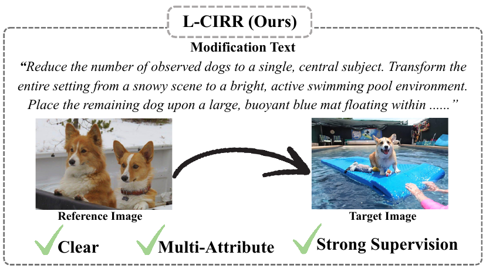</button>

  

    
Beyond Single Sentences: Composed Image Retrieval with Long-Form Modification Texts

    
Junyeong Jang, <strong>Seongwon Lee*</strong>

    
Asian Conference on Computer Vision (<strong>ACCV</strong>), 2026

    
<a href="../assets/bibtex/jang2026longform.bib" download>[Bib]</a>

  

  
<button type="button" class="publication-entry__thumbnail-button" data-publication-image="../images/lee2026resource.webp" data-publication-title="Resource-aware structural point-line RGB-D SLAM for dynamic indoor environments">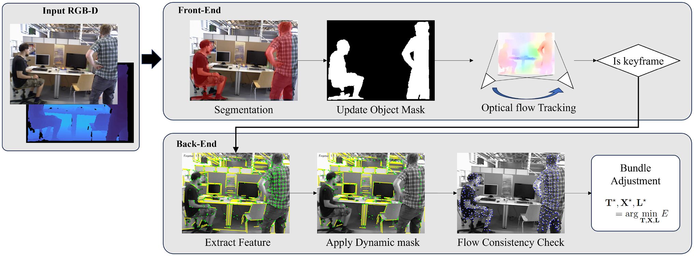</button>

  

    
Resource-aware structural point-line RGB-D SLAM for dynamic indoor environments

    
<strong>Seongwon Lee</strong>, Hyukdoo Choi, Hae Min Cho*

    
<strong>Scientific Reports</strong>, 2026

    
<a href="https://www.nature.com/articles/s41598-026-73677-3">[page]</a> <a href="https://www.nature.com/articles/s41598-026-73677-3_reference.pdf">[paper]</a> <a href="../assets/bibtex/lee2026resource.bib" download>[Bib]</a>

  

  
<button type="button" class="publication-entry__thumbnail-button" data-publication-image="../images/byeon2026cvar.webp" data-publication-title="CVAR: Cross-View Attention Refinement for Image Retrieval Reranking">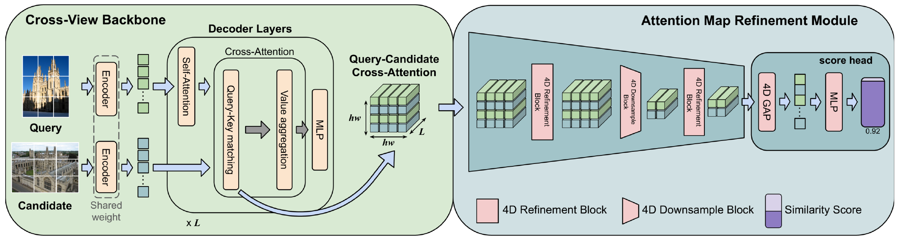</button>

  

    
CVAR: Cross-View Attention Refinement for Image Retrieval Reranking

    
Sangho Byeon, <strong>Seongwon Lee*</strong>

    
International Journal of Control, Automation and Systems (<strong>IJCAS</strong>), 2026

    
<a href="../assets/bibtex/byeon2026cvar.bib" download>[Bib]</a>

  

  
<button type="button" class="publication-entry__thumbnail-button" data-publication-image="../images/kim2026rayocc.png" data-publication-title="RayOcc: Occlusion-Aware Ray Occupancy Estimation via Gaussian Mixture Intensity">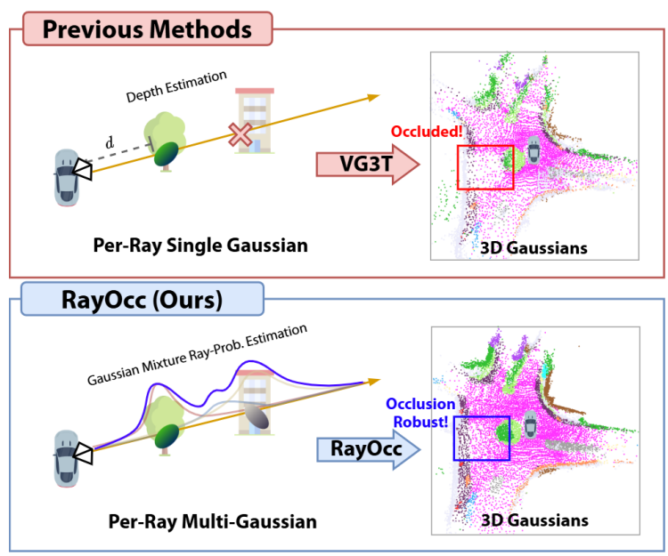</button>

  

    
RayOcc: Occlusion-Aware Ray Occupancy Estimation via Gaussian Mixture Intensity

    
Junho Kim, <strong>Seongwon Lee*</strong>

    
IEEE/RSJ International Conference on Intelligent Robots and Systems (<strong>IROS</strong>), 2026

    
<a href="https://cilab.kookmin.ac.kr/rayocc.github.io/">[project page]</a> <a href="https://arxiv.org/pdf/2607.17660">[paper]</a> <a href="https://arxiv.org/abs/2607.17660">[arXiv]</a> <a href="https://cilab.kookmin.ac.kr/rayocc.github.io/static/images/poster.pdf">[poster]</a> <a href="https://www.youtube.com/watch?v=zWqt4TjiGrQ">[video]</a>

  

  
<button type="button" class="publication-entry__thumbnail-button" data-publication-image="../images/kong2026rethinking.png" data-publication-title="Rethinking Pose Refinement in 3D Gaussian Splatting under Pose Prior and Geometric Uncertainty">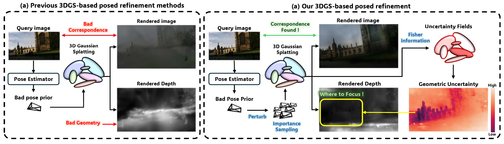</button>

  

    
Rethinking Pose Refinement in 3D Gaussian Splatting under Pose Prior and Geometric Uncertainty

    
Mangyu Kong, <strong>Seongwon Lee*</strong>, Euntai Kim*

    
IEEE/CVF Conference on Computer Vision and Pattern Recognition (<strong>CVPR</strong>), Jun 2026

    
<a href="https://kmk97.github.io/UGSLoc/">[project page]</a> <a href="https://openaccess.thecvf.com/content/CVPR2026/html/Kong_Rethinking_Pose_Refinement_in_3D_Gaussian_Splatting_under_Pose_Prior_CVPR_2026_paper.html">[page]</a> <a href="https://openaccess.thecvf.com/content/CVPR2026/papers/Kong_Rethinking_Pose_Refinement_in_3D_Gaussian_Splatting_under_Pose_Prior_CVPR_2026_paper.pdf">[paper]</a> <a href="https://openaccess.thecvf.com/content/CVPR2026/supplemental/Kong_Rethinking_Pose_Refinement_CVPR_2026_supplemental.pdf">[supp]</a> <a href="https://arxiv.org/abs/2603.16538">[arXiv]</a> <a href="https://github.com/kmk97/UGSLoc">[code]</a> <a href="https://www.youtube.com/watch?v=9GXaK05DBvE">[video]</a>

  

  
<button type="button" class="publication-entry__thumbnail-button" data-publication-image="../images/woo2026hypevpr.png" data-publication-title="HypeVPR: Exploring Hyperbolic Space for Perspective to Equirectangular Visual Place Recognition">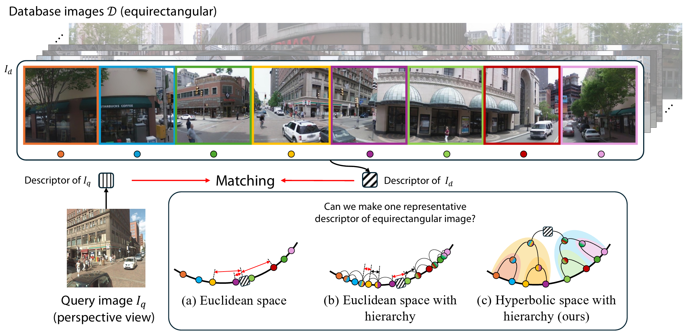</button>

  

    
HypeVPR: Exploring Hyperbolic Space for Perspective to Equirectangular Visual Place Recognition

    
Suhan Woo, <strong>Seongwon Lee</strong>, Jinwoo Jang, Euntai Kim*

    
IEEE/CVF Conference on Computer Vision and Pattern Recognition (<strong>CVPR</strong>), Jun 2026

    
<a href="https://cvpr.thecvf.com/virtual/2026/poster/38544">[page]</a> <a href="https://openaccess.thecvf.com/content/CVPR2026/papers/Woo_HypeVPR_Exploring_Hyperbolic_Space_for_Perspective_to_Equirectangular_Visual_Place_CVPR_2026_paper.pdf">[paper]</a> <a href="https://openaccess.thecvf.com/content/CVPR2026/supplemental/Woo_HypeVPR_Exploring_Hyperbolic_CVPR_2026_supplemental.pdf">[supp]</a> <a href="https://arxiv.org/abs/2506.04764">[arXiv]</a> <a href="https://www.youtube.com/watch?v=w4Sd3LEpUoQ">[video]</a>

  

  
<button type="button" class="publication-entry__thumbnail-button" data-publication-image="../images/kim2025vg3t.gif" data-publication-title="VG3T: Visual Geometry Grounded Gaussian Transformer"></button>

  

    
VG3T: Visual Geometry Grounded Gaussian Transformer

    
Junho Kim, <strong>Seongwon Lee*</strong>

    
IEEE International Conference on Robotics and Automation (<strong>ICRA</strong>), Jun 2026

    
<a href="https://cilab.kookmin.ac.kr/vg3t.github.io/">[project page]</a> <a href="https://arxiv.org/pdf/2512.05988">[paper]</a> <a href="https://arxiv.org/abs/2512.05988">[arXiv]</a> <a href="https://github.com/junho2000/VG3T">[code]</a> <a href="https://www.youtube.com/watch?v=ZU3eOOWFAys">[video]</a>

  

  
<button type="button" class="publication-entry__thumbnail-button" data-publication-image="../images/woo2025lat.gif" data-publication-title="Location-Aware Transformer Network for Bird's Eye View Semantic Segmentation"></button>

  

    
Location-Aware Transformer Network for Bird's Eye View Semantic Segmentation

    
Suhan Woo, Minseong Park, Youngjo Lee, <strong>Seongwon Lee</strong>, Euntai Kim*

    
Transactions on Intelligent Vehicles (<strong>TIV</strong>), Sep 2025

    
<a href="https://ieeexplore.ieee.org/document/10729649">[paper]</a>

  

  
<button type="button" class="publication-entry__thumbnail-button" data-publication-image="../images/kong2025fast.gif" data-publication-title="Fast Global Localization on Neural Radiance Field">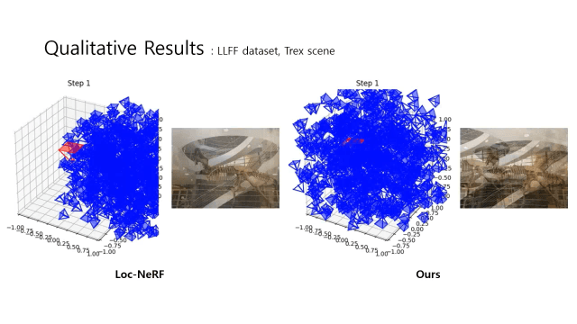</button>

  

    
Fast Global Localization on Neural Radiance Field

    
Mangyu Kong, Jaewon Lee, <strong>Seongwon Lee*</strong>, Euntai Kim*

    
IEEE International Conference on Robotics and Automation (<strong>ICRA</strong>), May 2025

    
<a href="https://ieeexplore.ieee.org/document/11128297/">[page]</a> <a href="https://arxiv.org/abs/2406.12202">[arXiv]</a> <a href="https://github.com/kmk97/Fast-Loc-NeRF">[code]</a>&nbsp;&nbsp;

  

  
<button type="button" class="publication-entry__thumbnail-button" data-publication-image="../images/lee2025cvnetds.png" data-publication-title="Correlation Verification for Image Retrieval and Its Memory Footprint Optimization">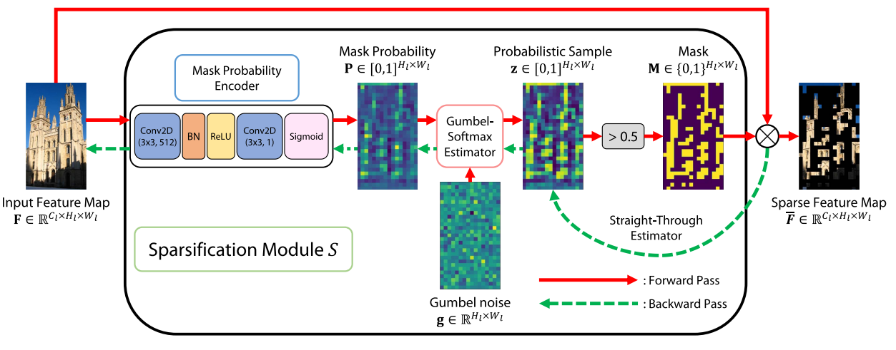</button>

  

    
Correlation Verification for Image Retrieval and Its Memory Footprint Optimization

    
<strong>Seongwon Lee</strong>, Hongje Seong, Suhyeon Lee, Euntai Kim*

    
Transactions on Pattern Analysis and Machine Intelligence (<strong>TPAMI</strong>), Mar 2025

    
<a href="https://ieeexplore.ieee.org/document/10759842">[paper]</a>

  

  
<button type="button" class="publication-entry__thumbnail-button" data-publication-image="../images/lee2024language.png" data-publication-title="Language-only Efficient Prompt Learning for Zero-shot Composed Image Retrieval">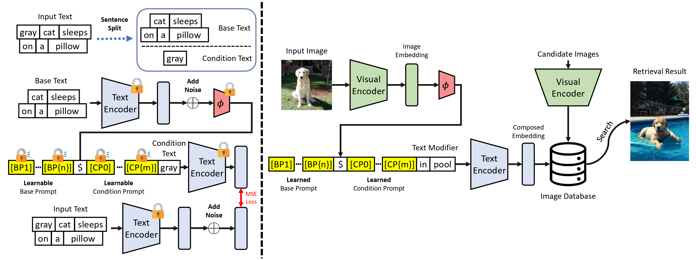</button>

  

    
Language-only Efficient Prompt Learning for Zero-shot Composed Image Retrieval

    
<strong>Seongwon Lee</strong>, Yong-Ju Lee*

    
European Conference on Computer Vision Workshop (<strong>ECCVW (Green-FOMO Workshop)</strong>), Oct 2024

  

  
<button type="button" class="publication-entry__thumbnail-button" data-publication-image="../images/kong2023room.gif" data-publication-title="RoomNeRF: Representing Empty Room as Neural Radiance Fields for View Synthesis"></button>

  

    
RoomNeRF: Representing Empty Room as Neural Radiance Fields for View Synthesis

    
Mangyu Kong, <strong>Seongwon Lee</strong>, Euntai Kim*

    
The British Machine Vision Conference (<strong>BMVC</strong>), Nov 2023

    
<a href="https://proceedings.bmvc2023.org/825/">[page]</a> <a href="https://papers.bmvc2023.org/0825.pdf">[paper]</a> <a href="https://bmvc2022.mpi-inf.mpg.de/BMVC2023/0825_supp.zip">[supp]</a> <a href="https://bmvc2022.mpi-inf.mpg.de/BMVC2023/0825_poster.pdf">[poster]</a>

  

  
<button type="button" class="publication-entry__thumbnail-button" data-publication-image="../images/lee2023revisiting.jpg" data-publication-title="Revisiting Self-Similarity: Structural Embedding for Image Retrieval">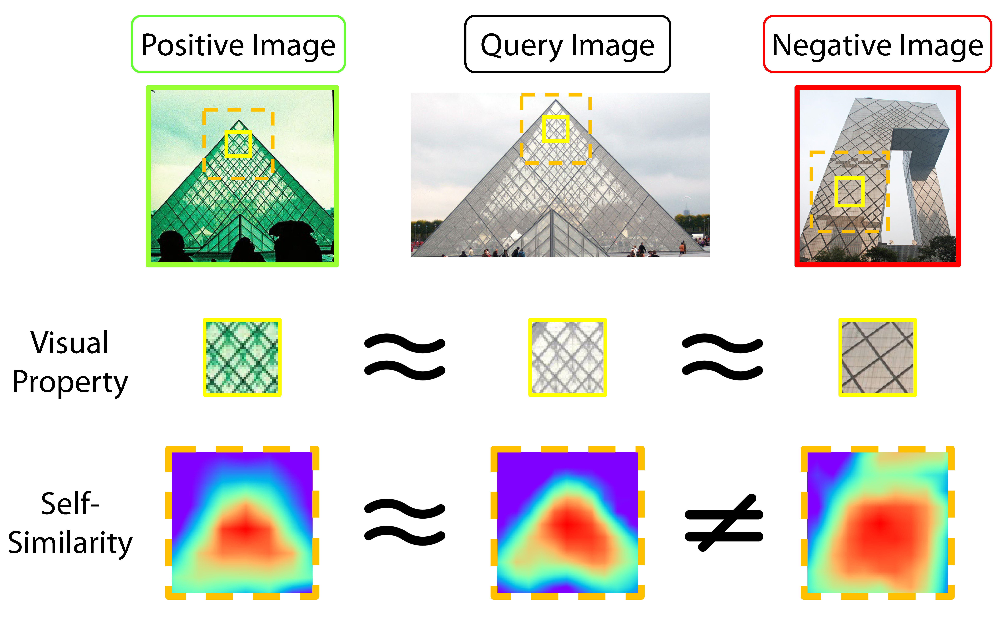</button>

  

    
Revisiting Self-Similarity: Structural Embedding for Image Retrieval

    
<strong>Seongwon Lee</strong>, Suhyeon Lee, Hongje Seong, Euntai Kim*

    
IEEE/CVF Conference on Computer Vision and Pattern Recognition (<strong>CVPR</strong>), Jun 2023

    
<a href="https://openaccess.thecvf.com/content/CVPR2023/html/Lee_Revisiting_Self-Similarity_Structural_Embedding_for_Image_Retrieval_CVPR_2023_paper.html">[page]</a> <a href="https://openaccess.thecvf.com/content/CVPR2023/papers/Lee_Revisiting_Self-Similarity_Structural_Embedding_for_Image_Retrieval_CVPR_2023_paper.pdf">[paper]</a> <a href="https://openaccess.thecvf.com/content/CVPR2023/supplemental/Lee_Revisiting_Self-Similarity_Structural_CVPR_2023_supplemental.pdf">[supp]</a> <a href="https://cvpr2023.thecvf.com/media/PosterPDFs/CVPR%202023/22752.png?t=1686640998.037478">[poster]</a> <a href="https://github.com/sungonce/SENet">[code]</a> <a href="https://www.youtube.com/watch?v=1_Kqu25roa4">[video]</a>&nbsp;&nbsp;

  

  
<button type="button" class="publication-entry__thumbnail-button" data-publication-image="../images/lee2022cvnet.jpg" data-publication-title="Correlation Verification for Image Retrieval">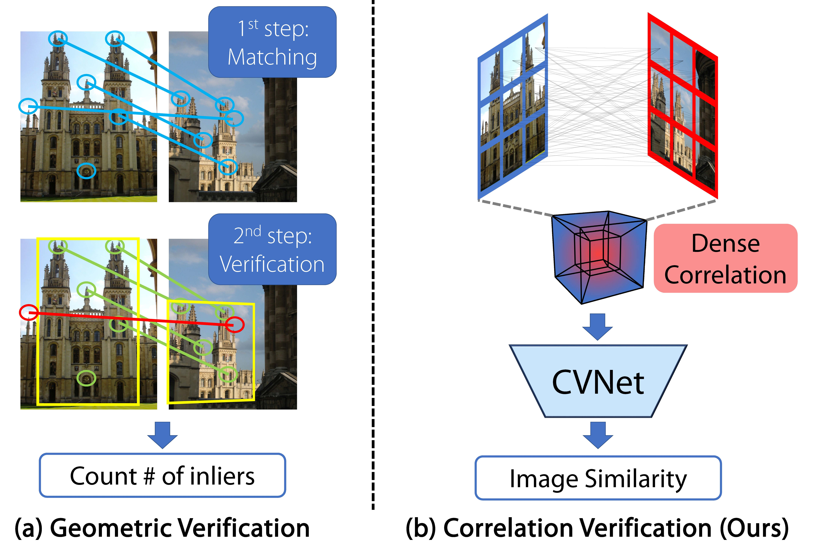</button>

  

    
Correlation Verification for Image Retrieval

    
<strong>Seongwon Lee</strong>, Hongje Seong, Suhyeon Lee, Euntai Kim*

    
IEEE/CVF Conference on Computer Vision and Pattern Recognition (<strong>CVPR</strong>), Jun 2022

    
 Selected as an <strong>Oral Presentation</strong> (Oral Presentation Acceptance Rate: 342/8161, <strong>4.2%</strong>)

    
 <strong>Winner</strong> at <a href="https://www.qualcomm.com/research/university-relations/innovation-fellowship/winners">Qualcomm Innovation Fellowship 2022</a>

    
 <strong>Excellence Vision Research Award</strong> at 1st Yonsei AI Workshop

    
 <strong>Encouragement Award</strong> at 2023-1 Graduate School of Yonsei University Thesis Award

    
<a href="https://openaccess.thecvf.com/content/CVPR2022/html/Lee_Correlation_Verification_for_Image_Retrieval_CVPR_2022_paper.html">[page]</a> <a href="https://openaccess.thecvf.com/content/CVPR2022/papers/Lee_Correlation_Verification_for_Image_Retrieval_CVPR_2022_paper.pdf">[paper]</a> <a href="https://openaccess.thecvf.com/content/CVPR2022/supplemental/Lee_Correlation_Verification_for_CVPR_2022_supplemental.pdf">[supp]</a> <a href="https://drive.google.com/file/d/1qZ4Ti-4pB249gR60XN7f2OzS-8lL4vQ4/view?usp=drive_link">[poster]</a> <a href="https://drive.google.com/file/d/1bT1WjrZrSAexQZ-eUZuFohoJ2o0rX2O0/view?usp=drive_link">[slide]</a> <a href="https://arxiv.org/abs/2204.01458">[arXiv]</a> <a href="https://github.com/sungonce/CVNet">[code]</a> <a href="https://www.youtube.com/watch?v=Yb8qc1UtTvc">[video]</a>&nbsp;&nbsp;

  

  
<button type="button" class="publication-entry__thumbnail-button" data-publication-image="../images/lee2022wildnet.jpg" data-publication-title="WildNet: Learning Domain Generalized Semantic Segmentation from the Wild">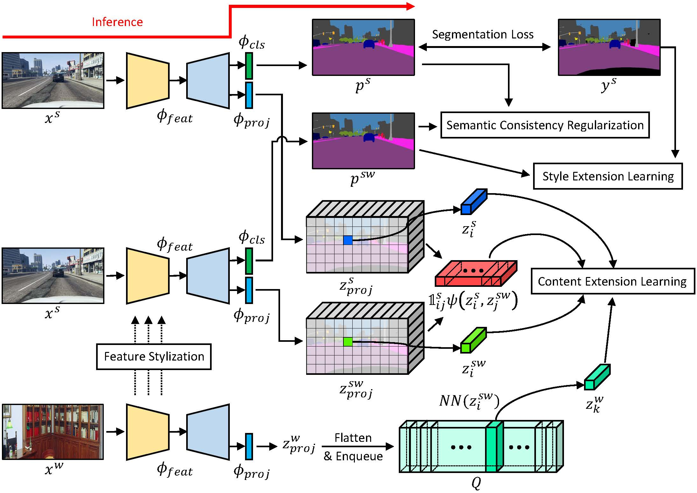</button>

  

    
WildNet: Learning Domain Generalized Semantic Segmentation from the Wild

    
Suhyeon Lee, Hongje Seong, <strong>Seongwon Lee</strong>, Euntai Kim*

    
IEEE/CVF Conference on Computer Vision and Pattern Recognition (<strong>CVPR</strong>), Jun 2022

    
 <strong>Finalist</strong> at <a href="https://www.qualcomm.com/research/university-relations/innovation-fellowship/finalists">Qualcomm Innovation Fellowship 2022</a>

    
<a href="https://openaccess.thecvf.com/content/CVPR2022/html/Lee_WildNet_Learning_Domain_Generalized_Semantic_Segmentation_From_the_Wild_CVPR_2022_paper.html">[page]</a> <a href="https://openaccess.thecvf.com/content/CVPR2022/papers/Lee_WildNet_Learning_Domain_Generalized_Semantic_Segmentation_From_the_Wild_CVPR_2022_paper.pdf">[paper]</a> <a href="https://openaccess.thecvf.com/content/CVPR2022/supplemental/Lee_WildNet_Learning_Domain_CVPR_2022_supplemental.pdf">[supp]</a> <a href="https://arxiv.org/abs/2204.01446">[arXiv]</a> <a href="https://github.com/suhyeonlee/WildNet">[code]</a>&nbsp;&nbsp;

  

  
<button type="button" class="publication-entry__thumbnail-button" data-publication-image="../images/seong2021hmmn.jpg" data-publication-title="Hierarchical Memory Matching Network for Video Object Segmentation">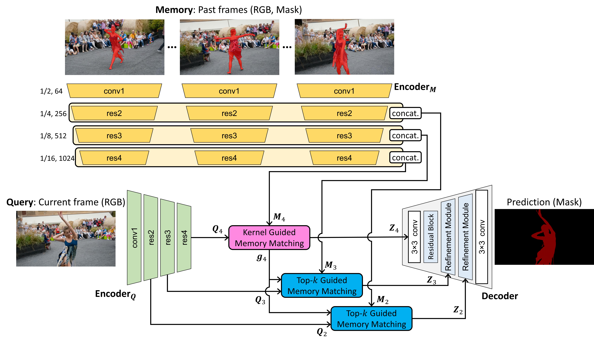</button>

  

    
Hierarchical Memory Matching Network for Video Object Segmentation

    
Hongje Seong, Seoung Wug Oh, Joon-Young Lee, <strong>Seongwon Lee</strong>, Suhyeon Lee, Euntai Kim*

    
IEEE/CVF International Conference on Computer Vision (<strong>ICCV</strong>), Oct 2021

    
<a href="https://openaccess.thecvf.com/content/ICCV2021/html/Seong_Hierarchical_Memory_Matching_Network_for_Video_Object_Segmentation_ICCV_2021_paper.html">[page]</a> <a href="https://openaccess.thecvf.com/content/ICCV2021/papers/Seong_Hierarchical_Memory_Matching_Network_for_Video_Object_Segmentation_ICCV_2021_paper.pdf">[paper]</a> <a href="https://openaccess.thecvf.com/content/ICCV2021/supplemental/Seong_Hierarchical_Memory_Matching_ICCV_2021_supplemental.pdf">[supp]</a> <a href="https://arxiv.org/abs/2109.11404">[arXiv]</a> <a href="https://github.com/Hongje/HMMN">[code]</a>&nbsp;&nbsp;

  

# 🏆 Honors and Awards
- *(Jul 2023)* 2023-1 Graduate School of Yonsei University Thesis Award (2023)
  - Encouragement Award - *Correlation Verification for Image Retrieval* (CVPR 2022)
- *(Nov 2022)* [Qualcomm Innovation Fellowship 2022](https://www.qualcomm.com/research/university-relations/innovation-fellowship/winners)
  - Winner ($4,000) - *Correlation Verification for Image Retrieval* (CVPR 2022)
- *(Oct 2022)* 1st Yonsei AI Workshop (2022)
  - Excellence Vision Research Award - *Correlation Verification for Image Retrieval* (CVPR 2022)

# 💼 Projects
- *(Jul 2026 - Jun 2029)* Basic Research Laboratory for Next-Generation Hyper-Cognitive and Hyper-Adaptive Action Foundation Models
  - Funding from Basic Research Laboratory (BRL) Program, National Research Foundation of Korea (NRF)
- *(May 2026 - Nov 2026)* Demonstration of Digital Twin Learning and Scene Composition Technologies Based on 3D Reconstruction
  - Funding from Electronics and Telecommunications Research Institute (ETRI)
- *(Mar 2026 - Present)* Vision-based Cargo and Cargo Label Recognition on Robots in Logistics Warehouse Environments
  - Funding from BStar Robotics
- *(Mar 2026 - Present)* Vision-Language Navigation Agents via Cyclic Expansion of Web-Scale Video, Augmented Simulation, and the Real World
  - Funding from National Research Foundation of Korea (NRF)
- *(Apr 2025 - Nov 2025)* Development of High-Fidelity Vehicle Representation via 3D Gaussian Splatting
  - Funding from Korea Electronics Technology Institute (KETI)
- *(Jun 2025 - Nov 2025)* Development of Brain Signal Based Image Generation
  - Funding from Electronics and Telecommunications Research Institute (ETRI)
- *(Aug 2023 - Aug 2024)* Development of AI Autonomy and Knowledge Enhancement for AI Agent Collaboration
  - Funding from Information & Communications Technology Promotion (IITP)
- *(Apr 2022 - Dec 2022)* Development of Deep Learning-Based Fine-Matching Technology using ToF Depth Sensor
  - Funding from LG Electronics
- *(May 2021 - Dec 2021)* Development of Deep Learning-Based Image Retrieval Technology using ToF Depth Sensor
  - Funding from LG Electronics
- *(Apr 2020 - Feb 2021)* Development of Front-Down SLAM Technology Based on ToF Depth Sensor
  - Funding from LG Electronics
- *(Apr 2019 - Dec 2019)* Development of Depth Map Generation Technology using Continuous Stereo Images
  - Funding from Hyundai AutoEver
- *(Oct 2017 - Feb 2019)* Development of Integration Module Technology for Localization and Autonomous Driving Control Based on Multi-modal Sensor for Wheel Drive Service Robot
  - Funding from Ministry of Trade, Industry and Energy (MOTIE)
- *(Oct 2016 - Oct 2017)* Development of Robot Autonomous Driving Technology using Laser Scanner
  - Funding from Hitachi-LG Data Storage
- *(May 2016 - Apr 2020)* Development of Robot Intelligence Technology for Mobility with Learning Capability toward Robust and Seamless Indoor and Outdoor Autonomous Navigation
  - Funding from Ministry of Trade, Industry and Energy (MOTIE)

# 📝 Academic Services
- Invited Talks
   - *(Sep 2025)* Neural Rendering: Creating Reality with AI
      - School of Electrical and Electronic Engineering, Yonsei University
   - *(Jul 2025)* Neural Rendering Using Vision and LiDAR and Its Application in Map Representation
      - SOSLAB
   - *(Jul 2025)* Recent Advances in Computer Vision: Foundation Models, Vision-Language Models and 3D Neural Representations
      - School of Computing, Gachon University
   - *(Apr 2025)* Neural Rendering: NeRF and 3D Gaussian Splatting
      - Korea Electronics Technology Institute (KETI)
   - *(Mar 2025)* Match and Extend: Visual-Based Matching and 3D Reconstruction Technology
      - Electronics and Telecommunications Research Institute (ETRI)
   - *(Jan 2024)* Recent Advances in Computer Vision: Foundation Models, Vision-Language Models and 3D Neural Representations [[slide]](https://drive.google.com/file/d/1AS2djykCUuBL5o9tbf6CG_T8U4xLkZlB/view?usp=drive_link)
      - School of Electrical and Electronic Engineering, Yonsei University
   - *(Oct 2023)* Introduction to Image Retrieval: Local Features & beyond [[slide]](https://drive.google.com/file/d/1fW5CCr2GB1FcbikLkqMRpAipIjUtzOMP/view?usp=drive_link)
      - Department of Electronic Engineering, Jeonbuk National University
- Reviewer
   - Conference
      - IEEE/CVF Computer Vision and Pattern Recognition Conference (CVPR)
      - European Conference on Computer Vision (ECCV)
      - IEEE/CVF International Conference on Computer Vision (ICCV)
      - IEEE International Conference on Robotics and Automation (ICRA)
      - IEEE/RSJ International Conference on Intelligent Robots and Systems (IROS)
      - Asian Conference on Computer Vision (ACCV)
   - Journal
      - IEEE Transactions on Pattern Analysis and Machine Intelligence (TPAMI)
      - IEEE Transactions on Automation Science and Engineering (T-ASE)
      - International Journal of Control, Automation and Systems (IJCAS)
